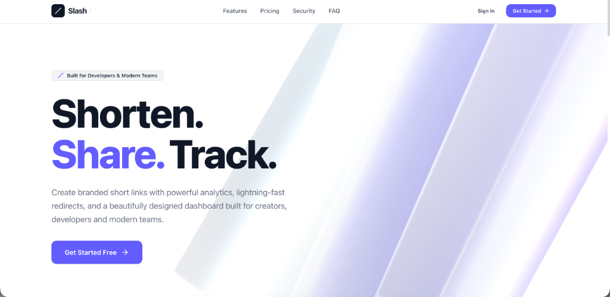
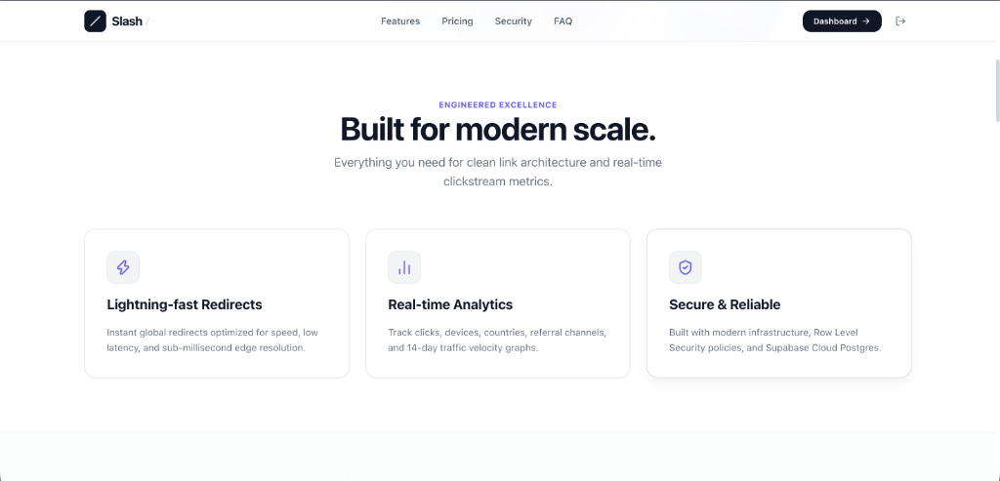
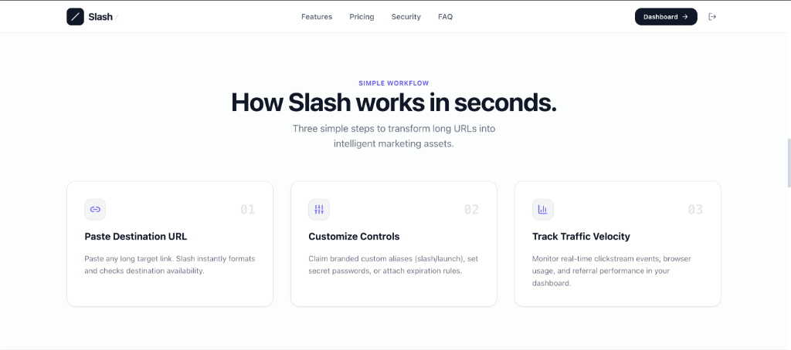
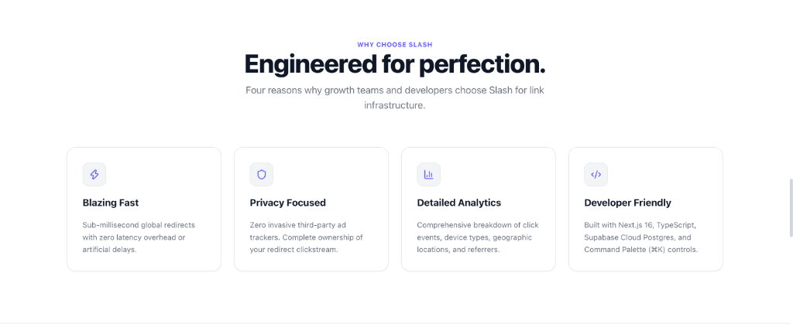

# Slash — Modern Link Infrastructure & Analytics Engine

[](https://nextjs.org/)
[](https://react.dev/)
[](https://threejs.org/)
[](https://supabase.com/)
[](https://tailwindcss.com/)
[](https://slash-urlshortner.vercel.app/)

**Slash** is an enterprise-grade URL shortener and real-time clickstream analytics platform. Built with Next.js 16 App Router, Three.js 3D WebGL shaders, Supabase Cloud Postgres, and Tailwind CSS v4.

🌐 **Live Demo**: [slash-urlshortner.vercel.app](https://slash-urlshortner.vercel.app/)  
📁 **GitHub Repository**: [github.com/chiragdebugs/urlshortner](https://github.com/chiragdebugs/urlshortner)

---

## ⚡ Hero Section — Shorten. Share. Track.

The landing page features living 3D WebGL translucent slash planes rendered with custom GLSL shaders, traveling sunlight specular reflections, and responsive mouse depth parallax.



---

## 🚀 Engineered Excellence — Built for Modern Scale

Core technical capabilities engineered for performance, security, and low-latency redirect resolution.



- **Lightning-fast Redirects**: Sub-millisecond global redirects powered by Next.js Route Handlers and database indexing.
- **Real-time Analytics**: Track clicks, referral channels, browser distribution, and 14-day traffic velocity graphs.
- **Secure & Reliable**: Built with modern infrastructure, Row Level Security (RLS) policies, and Supabase Cloud Postgres.

---

## ⚙️ Simple Workflow — How Slash Works in Seconds

Transform long, unwieldy target URLs into intelligent marketing assets in three simple steps.



1. **Paste Destination URL**: Input any target link; Slash formats and validates destination availability.
2. **Customize Controls**: Attach custom branded aliases (`slash/launch`), set password protection, or assign expiration dates.
3. **Track Traffic Velocity**: Monitor clickstream events, device performance, and geographic analytics in real-time.

---

## 🛡️ Why Choose Slash — Engineered for Perfection

Four core architectural pillars engineered for growth teams and developers.



- **Blazing Fast**: Low-latency edge resolution with zero artificial redirect delays.
- **Privacy Focused**: Zero invasive third-party ad trackers. Complete data ownership.
- **Detailed Analytics**: Comprehensive breakdown of click velocity, devices, locations, and referrers.
- **Developer Friendly**: Built with Next.js 16, TypeScript, Supabase, and Command Palette (`⌘K`) controls.

---

## ✨ Ready to Experience Modern Link Management?

Get started in seconds with zero setup required, or sign in to access your complete analytics workspace.


---

## 🛠️ Tech Stack & Architecture

### **Frontend & UI**
- **Framework**: Next.js 16 (App Router, Turbopack)
- **UI Library**: React 19
- **Styling**: Tailwind CSS v4, Lucide Icons
- **Animation**: Framer Motion, Canvas Confetti

### **3D Graphics & WebGL**
- **Engine**: Three.js
- **React Wrapper**: `@react-three/fiber`, `@react-three/drei`
- **Shaders**: Custom GLSL Vertex & Fragment Glass Shaders

### **Backend & Authentication**
- **Database**: Cloud Postgres (Cloud Managed)
- **Authentication**: Supabase Auth (Email/Password & Google OAuth)
- **Security**: Row Level Security (RLS) policies

---

## 🚀 Local Development Setup

### 1. Clone the Repository
```bash
git clone https://github.com/chiragdebugs/urlshortner.git
cd urlshortner
```

### 2. Install Dependencies
```bash
npm install
```

### 3. Configure Environment Variables
Create a `.env.local` file in the root directory:
```env
NEXT_PUBLIC_SUPABASE_URL=https://your-supabase-project.supabase.co
NEXT_PUBLIC_SUPABASE_ANON_KEY=your-supabase-anon-key
NEXT_PUBLIC_SITE_URL=http://localhost:3000
```

### 4. Run Development Server
```bash
npm run dev
```
Open [http://localhost:3000](http://localhost:3000) in your browser.

---

## 👨‍💻 Author

**Chirag Tapre**
- **GitHub**: [@chiragdebugs](https://github.com/chiragdebugs)
- **LinkedIn**: [Chirag Tapre](https://www.linkedin.com/in/chirag-tapre-47a426192/)
